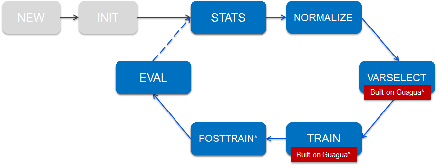

[](https://travis-ci.org/wuhaifengdhu/pyshifu)

# pyshifu
pyshifu is a Python module for machine learning build on top of java version shifu, which provided large scalability of
build high accuracy models with TB level data set in hours.          

More details about shifu, visit shifu's wiki page: https://github.com/shifuml/shifu/wiki            
     

pyshifu provided the basic operations in the pipeline above, such as new, init, stats...        


## Installation   
### Dependencies   
shifu requires:     
 * Python(>=2.7 or >=3.3)   
 * Java(>=7.0)   

Shifu Optional:   
 * Hadoop   
 
 
Platform requirement:   
 * Mac    
 * Linux     
 * Windows(>=10586.1007)      
As pyshifu currently depended on bash script to set environment, so windows without shell support could not work correctly.
In the future, we will remove all shell script.


### User installation
The easiest way to install pyshifu is using pip:     
```bazaar
pip install pyshifu
```
or use conda:         
```bazaar
conda install pyshifu
```


## Development
We welcome new contributors of all experience levels. The shifu community goals are to be helpful, welcoming, and
 effective. The [Contribute Guide](http://shifu.ml/project/about/#how-to-contribute) has detailed information about contributing code, documentation, tests, and more. 
 We've included some basic information in this README.

### Important links
* Official source code repo: https://github.com/ShifuML/pyshifu
* Download releases: https://pypi.python.org/pypi/pyshifu
* Issue tracker: https://github.com/ShifuML/pyshifu/issues

### Source code
You can check the latest sources with the command:
```bazaar
git clone https://github.com/ShifuML/pyshifu.git
```

### Setting up a development environment
[Quick tutorial](doc/developers/Guide.md) on how to go about setting up your environment to contribute to pyshifu.

### Testing
This project intend to make the python code 100% test coverage. You can test by tox.  
```bazaar
pip install -r requirements-build.txt
# run the python tests
tox -r
```
### Submitting a Pull Request
Before opening a Pull Request, have a look at the full Contributing page to make sure your code complies with our [Develop Guide](doc/developers/Guide.md).
## Project History
This project is started for help user using shifu in python environment. 

## Help and Support
### Documentation
* User guide: [User Guide](doc/users/Guide.md)
* Develop document: [Develop Guide](doc/developers/Guide.md)
* FAQ page: https://github.com/ShifuML/pyshifu/wiki/FAQ-page

### Communication
You can leave your message here, [Message Board](https://github.com/ShifuML/pyshifu/wiki/Message-Board).

### Citation
If you use scikit-learn in a scientific publication, we would appreciate [Citations](https://github.com/ShifuML/pyshifu/wiki/Citations).

### Thanks
1, Thanks kyhau for python-repo-template project to create an empty python module.
https://github.com/kyhau/python-repo-template

